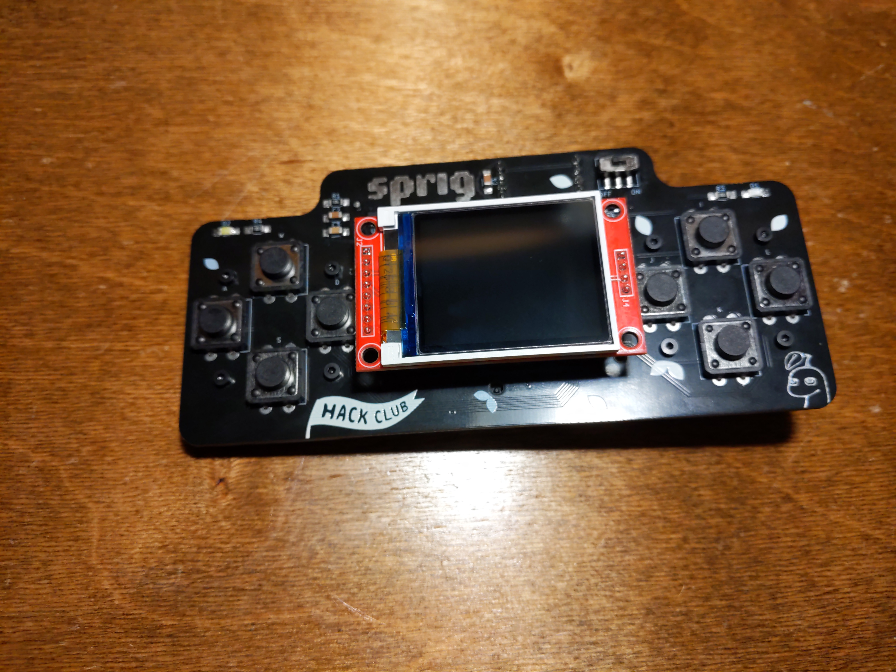

# SprigAaru
SprigAaru is my personal fork and playground based on Sprig.

I use this repo to experiment with:

- game engine ideas
- firmware and embedded work
- game projects and prototypes

## Current Status
This is a personal project where I build and test things as I learn.

- The `games/` folder currently has my games, and more?
- I plan to add more games over time.

## Repository Areas

- `engine/`: engine code and related tooling
- `firmware/`: firmware, hardware support, and embedded build scaffolding
- `games/`: personal game files and prototypes
- `docs/`: setup notes, runbooks, and project documentation
- `hardware/`: hardware design files and references

## Upstream Credit
This project builds on the open-source work from Hack Club's Sprig project.

## License
This repository is licensed under the MIT License. See [LICENSE](./LICENSE).

> The project has been archived due to the sprig getting bricked. I might fix it in the future if I get time <3
